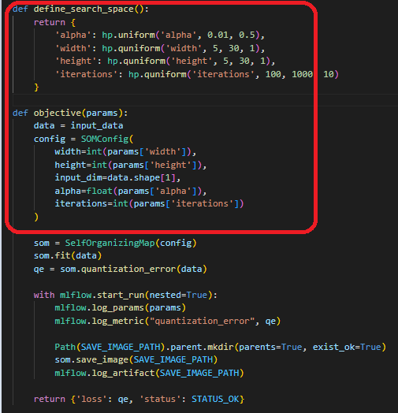
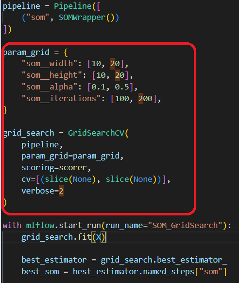

# mantelgroup_assessment

## Code Observations and Recommendations

### Initial Code Observations

- <B>All-in-One Script</B>
   -  The entire script is tightly couples training logic, configuration, data generation, initialization, and visualization, will be hard to reuse, test, or extend
- <B>Performance Issues</B>
    -  Nested for-loops are used for updating weights and computing distances to the BMU.
    - Looping over all grid cells to compute influence and update weights is inefficient

- <B>Lack of evaluation metrics<B>
   -There's no mechanism to quantify SOM quality (e.g., quantization error, Topographic error)   
- Hyperparameters (eg. width height and  iterations etc) are hardcoded, limiting flexibility for experimentation or optimization.
- <B>No Parameter Validation<B>:
   - Lacks checks for input shape, dimensionality, or valid value ranges, increasing the risk of runtime errors   
- The trained weights/model are neither saved nor reloadable, and the visualization logic is hardcoded—limiting reusability and modular integration.

---

### Top Recommendations

<details>
<summary> 1. Class-Based Design </summary>
   - Introduced a `SelfOrganizingMap` class to encapsulate model logic and state.
   - Improved clarity and reusability.
<br>

| Before Refactor |   | After Refactor |
|-----------------|---|----------------|
|  |  |  |


</details>

<details>
<summary> 2. Performance </summary>

- Instead of nested for loops for compute influence and update weights, We can use numpy vectorization and broad casting
    - Precompute coordinate grids to avoid recalculating positions in every iteration.
    - Vectorize distance computations and weight updates using NumPy broadcasting.


<br>

| Before Refactor |   | After Refactor |
|-----------------|---|----------------|
|  |  |  |
</details>


<details>
<summary>3. Small, Single-Responsibility Functions</summary>

- Spliited into multiple smaller functions for more readability and maintainability
</details>    

<details>
<summary>4. Config Validation with Pydantic, type hints and doc strings</summary>
 
 - Config validation using Pydantic, with clear type hints and descriptive docstrings to enhance reliability, readability, and developer experience.
   - `SOMConfig` ensures proper types (e.g., `PositiveInt`, `alpha ∈ (0,1)`).
   -  Catches configuration errors early.
</details>   

<details>
<summary>5. Hyperparameter Optimisation </summary>

<details>
<summary>Option1. Hyperopt</summary>
- We can do find best parameter based on quantization error

| Hardcoded Parameter |   | Parameters as Pydantic Config |
|----------------------|---|---------------------|
|  |  |  |

- Example: Given ./examples/som_hyperopt.py

</details>

<details>
<summary>Option2: Sklearn GridSearchCV</summary>

   - Seperated core logic SOM and created sklearn wrapper class to support SKlearn pipeline and Hyper parameter tuning like `GridSearchCV`.   
   Note:Below are my thought process on GridSearchCV with SOM
   - The code given for challenge manually tests two configurations of SOM training,so need to overcome with structured approach for bench marking by integrating with experiment tracking like MLflow.
      - First run: iterations=100, x_dim=10, y_dim=10
      - Second run: iterations=1000, x_dim=100, y_dim=100
   - As self organizing maps are unsupervised learning,so we can introduce some custom scorer with `Quantization Error' or any metrics related to SOM to use in GridSearchCV to evaluate.
   - Cross-validation isn't meaningful for SOMs; used `cv=[(slice(None), slice(None))]` to disable CV. 

### Original Challenge Code vs GridSearch

| Hardcoded Parameter |   | Parameters as Pydantic Config |
|----------------------|---|---------------------|
|  |  |  |


| Feature                         | Original Challenge Code                                | GridSearchCV Implementation                                  |
|--------------------------------|---------------------------------------------------------|---------------------------------------------------------------|
| Automated parameter sweep    | Manually evaluated two hardcoded configurations         | Systematic testing of hyperparameter combinations             |
| Scoring via custom function  | No scoring logic applied — relied on manual inspection  | Evaluates SOM quality using domain-specific metrics (Quantization Error) |
| MLflow integration           | No logging or experiment tracking                       | Logs each trial with parameters|

</details>
</details>

<details>
<summary>6. Add Unit Tests for Production Reliability</summary>

- Implement a complete unit test suite using pytest to ensure functional correctness and prevent regressions
</details>

<details>
<summary>7.Package & Distribute</summary>

- Package the Kohonen SOM code as a Python module and publish it to Artifact Registry for secure, versioned distribution. This enables seamless installation via pip across notebooks, pipelines, and production environments.
- Containerize the application with Docker and expose it via a Flask API to enable easy access to SOM endpoints (e.g., BMU prediction)
</details>

## Example Usage:
<details>
<summary>1. With Core SOM logic:</summary>
<pre>
import numpy as np
from som.model import SelfOrganizingMap
from som.config import SOMConfig
   if __name__ == '__main__':
      data = np.random.random((100, 3))
      config = SOMConfig(width=20, height=20, input_dim=3, alpha=0.1, iterations=100)
      som = SelfOrganizingMap(config)
      som.fit(data)
      som.save_image("output.png")
</pre><br>      
      </details>   

<details>
<summary>2. SOM Optimization with GridSearchCV and MLflow </summary>

<pre>
import numpy as np
import mlflow
from sklearn.pipeline import Pipeline
from sklearn.model_selection import GridSearchCV
from src.sklearn_wrapper.som_wrapper import SOMWrapper

# A proper metrics for SOM need to be implemented (e.g Quantization error).For now made a prototype of dummy scorer and evaluate method, need to be coded with proper SOM metrics
def scorer(estimator, X):
    metrics = estimator.evaluate(X)
    return -metrics["quantization_error"]

if __name__ == "__main__":
    X = np.random.random((100, 3))

    pipeline = Pipeline([
        ("som", SOMWrapper())
    ])

    param_grid = {
        "som__width": [10, 20],
        "som__height": [10, 20],
        "som__alpha": [0.1, 0.5],
        "som__iterations": [100, 200],
    }

    grid_search = GridSearchCV(
        pipeline,
        param_grid=param_grid,
        scoring=scorer,
        cv=[(slice(None), slice(None))],
        verbose=2
    )

    with mlflow.start_run(run_name="SOM_GridSearch"):
        grid_search.fit(X)

        best_estimator = grid_search.best_estimator_
        best_som = best_estimator.named_steps["som"]

        metrics = best_som.evaluate(X)

        mlflow.log_params(grid_search.best_params_)
        mlflow.log_metrics(metrics)

        best_som.save_image("best_som.png")
        best_som.save_weights("best_weights.npy")

        mlflow.log_artifact("best_som.png")
        mlflow.log_artifact("best_weights.npy")

        print("Best Params:", grid_search.best_params_)
        print("Metrics:", metrics)
        
        
    # Train SOM
    som = SOMWrapper(width=10, height=10, input_dim=3, alpha=0.1, iterations=100)
    som.fit(X)
    som.save_model("/mnt/data/som_model")
    som.save_image("/mnt/data/som_output.png")
    
    # Load model and predict
    som_loaded = SOMWrapper.load_model("/mnt/data/som_model")
    predictions = som_loaded.predict(X)  
</pre>
</details>

<details>
<summary>3. SOM Optimization with hyperopt and MLflow</summary>

<pre>
 
 import numpy as np
import mlflow
from hyperopt import fmin, tpe, hp, STATUS_OK, Trials
from pathlib import Path
from src.som.model import SelfOrganizingMap  
from src.som.config import SOMConfig        

input_data = np.random.random((100, 3))          
SAVE_IMAGE_PATH = "artifacts/som_map.png"

def load_data(path):
    return np.load(path)

def define_search_space():
    return {
        'alpha': hp.uniform('alpha', 0.01, 0.5),
        'width': hp.quniform('width', 5, 30, 1),
        'height': hp.quniform('height', 5, 30, 1),
        'iterations': hp.quniform('iterations', 100, 1000, 10)
    }

def objective(params):
    data = input_data
    config = SOMConfig(
        width=int(params['width']),
        height=int(params['height']),
        input_dim=data.shape[1],
        alpha=float(params['alpha']),
        iterations=int(params['iterations'])
    )

    som = SelfOrganizingMap(config)
    som.fit(data)
    qe = som.quantization_error(data)  

    with mlflow.start_run(nested=True):
        mlflow.log_params(params)
        mlflow.log_metric("quantization_error", qe)

        Path(SAVE_IMAGE_PATH).parent.mkdir(parents=True, exist_ok=True)
        som.save_image(SAVE_IMAGE_PATH)
        mlflow.log_artifact(SAVE_IMAGE_PATH)

    return {'loss': qe, 'status': STATUS_OK}

def run_hyperopt():
    trials = Trials()
    best = fmin(
        fn=objective,
        space=define_search_space(),
        algo=tpe.suggest,
        max_evals=50,
        trials=trials
    )
    print("Best SOM hyperparameters:", best)

if __name__ == "__main__":
    mlflow.set_experiment("SOM Quantization Benchmark")
    run_hyperopt()

</pre>
</details>


---

### Project Structure
```
mantelgroup_assessment/
├── src/                               # Core SOM implementation
│   └──som/ 
│   |  └──config.py                    # SelfOrganizingMap class
│   |  └──model.py                     # Pydantic SOMConfig model             
│   └──sklearn_wrapper/
|      └──som_wrapper.py               # Sklearn wrapper for pipeline
|
|
├── tests/                             # Unit tests for SOM components
│   └── test_model.py
│
├── examples/                          # Example usage scripts
│   └── run_som.py
|   └── som_hyperparameter_mlflow.py   # Example with hyperParameter using gridsearch and tracking with mlflow
|   └── som_hyperopt.py                # Example with hyperParameter using hyperopt and tracking with mlflow
│
├── noteboooks/                        # Example usage notebooks
│   └── som.ipynb
├── requirements.txt                   # Python dependencies
├── README.md                          # Project overview and usage
```


